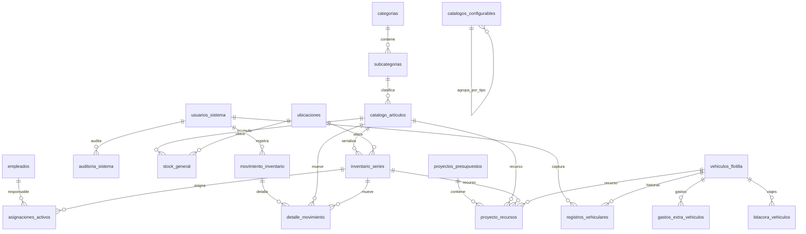

# Diagrama Entidad-Relacion Base

## Notas
- `movimiento_inventario.folio` es el identificador formal visible del movimiento.
- `inventario_series.ubicacion_id` y `stock_general.ubicacion_id` son la ubicacion fisica formal.
- `catalogos_configurables` concentra estados, estatus, tipos de movimiento, marcas y tipos de activo.
- `auditoria_sistema` conserva cambios, soft deletes, restores y eventos operativos.
